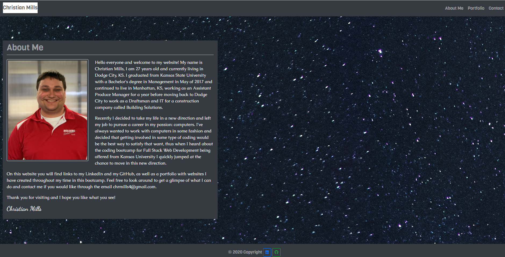
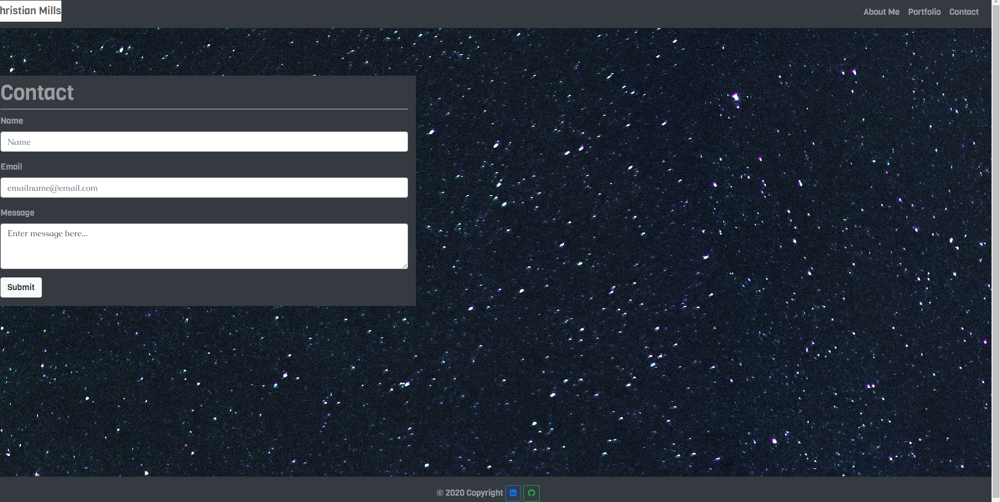
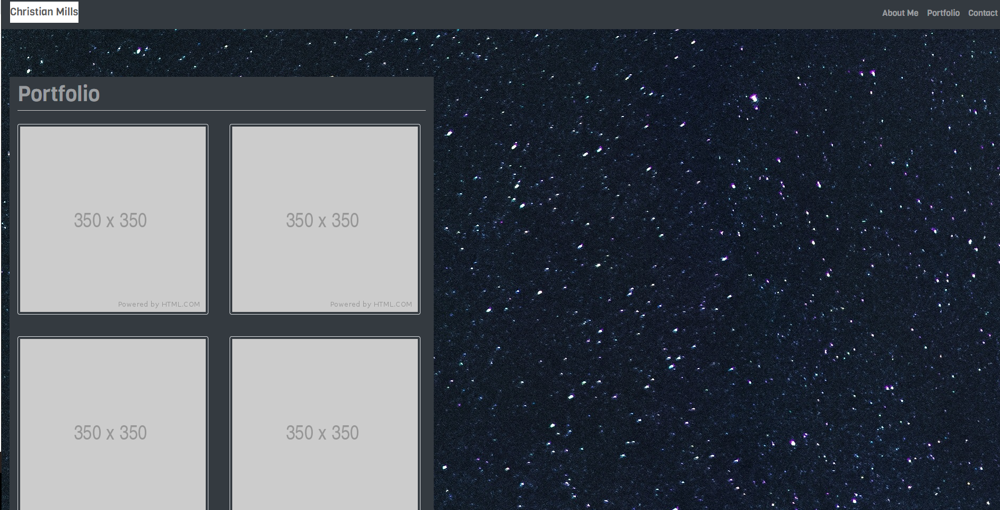

# [Responsive Portfolio](https://millsy4.github.io/02_responsive_portfolio/)

This is a website that will hold my portfolio of websites that I create during this class, have information about me, and later it will have a way to contact me.  It is also responsive, meaning it will adjust styles to fit the screen it is pulled up on.

Tools I used to complete this include:

- [Bootstrap](https://getbootstrap.com/)

- [FontAwesome](https://fontawesome.com/)

- [Google Fonts](https://fonts.google.com/)

The main point of this website was to learn how to effectively use Bootstrap, as well as, how to make your websites responsive.  In the day and age of smart phones it is essential that your web design be able towork well on mobile devices.

I made this website with full intention of slowly editting it as I learn more stuff throughout the class and making it the best way possible to really see what I can offer to employers.  As of right now there are only placeholders for most content, except the About Me, but the intention is to fill it with stuff I create during this class and beyond.

